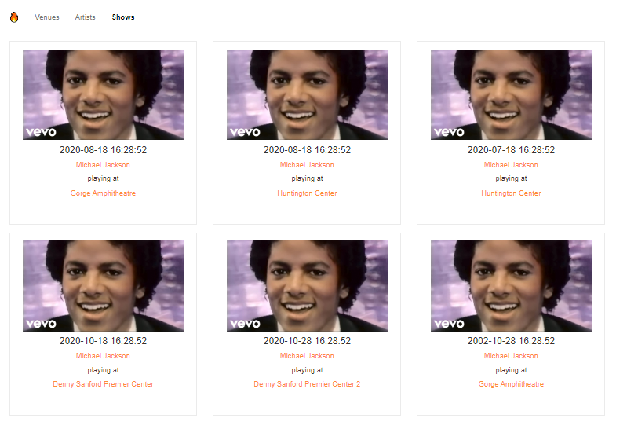

# Fyyur: Artist Booking Site

This is part of my capstone project for udacity's full-stack developer nano degree.

 

# Use Cases

> ## 1) Post Venue
> The diary app uses Auth0 to provide authentication for users.

| Post Venue  | Input Validation |
| ------------- | ------------- |
|   |   |

> ## 2) Post Artist

| Post Artist  | Input Validation |
| ------------- | ------------- |
|   |   |

> ## 3) Post Show 

| Post Show  | Input Validation |
| ------------- | ------------- |
|   |   |

> ## 4) Browse & Search venues
| All venues  | Filtered venues |
| ------------- | ------------- |
|   |   |

> ## 5) Browse & Search artists
| All artists  | Filtered artists |
| ------------- | ------------- |
|   |   |

> ## 6) Browse & Search shows

> ## 6) Venue details

> ## 6) Artist details

